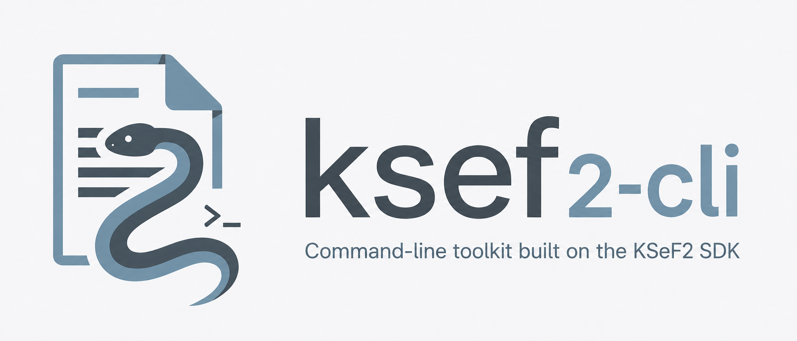

<div align="center">
<a href="https://github.com/stacking-hq/ksef2-cli" title="ksef2-cli">
  
</a>

**Command-line interface for the [`ksef2`](https://github.com/stacking-hq/ksef2) Python SDK.**

</div>

The CLI is intentionally stateless: authenticated commands accept credentials from
global options or environment variables instead of writing secrets to a local config
file.

## Install / Run

```bash
pip install ksef2-cli
ksef2 --help
```

For an isolated CLI install:

```bash
uv tool install ksef2-cli
# or
pipx install ksef2-cli
```

The package exposes both commands:

```bash
ksef2
ksef2-cli
```

## Documentation

Published documentation is assembled into <https://docs.ksef2.dev/cli/>.
Source documentation lives in [`docs/`](docs/).

## Authentication

Global options must be placed before the command group:

```bash
uv run ksef2 --env test --nip 5261040828 --test-cert auth login --json
uv run ksef2 --nip 5261040828 --token "$KSEF_TOKEN" invoices metadata --date-from 2026-01-01T00:00:00Z
```

Supported auth methods:

- `--token` / `KSEF2_TOKEN`
- `--test-cert` for the TEST environment
- `--cert` and `--key` for PEM XAdES credentials
- `--p12` for PKCS#12/PFX XAdES credentials

Common environment variables:

```bash
export KSEF2_NIP=5261040828
export KSEF2_TOKEN=...
```

Precedence is:

1. CLI options such as `--nip` and `--token`
2. Environment variables such as `KSEF2_NIP` and `KSEF2_TOKEN`
3. Local config file defaults

## Local Config

For local development, create a config file under your home directory:

```bash
uv run ksef2 config init --nip 5261040828
```

By default the file is:

```text
~/.config/ksef2-cli/config.toml
```

You can override it with `--config path/to/config.toml` or `KSEF2_CONFIG`.
Use `--no-config` to ignore the file for one invocation.

Example config:

```toml
[auth]
nip = "5261040828"
token = "..."
context_type = "nip"
```

Tokens in this file are plaintext. The CLI creates files with mode `0600`, but
`KSEF2_TOKEN` is still the better default on shared machines or CI.

## Examples

Query invoice metadata:

```bash
uv run ksef2 --nip "$KSEF2_NIP" --token "$KSEF2_TOKEN" \
  invoices metadata --role seller --date-from 2026-01-01T00:00:00Z --all
```

Download one processed invoice XML:

```bash
uv run ksef2 --nip "$KSEF2_NIP" --token "$KSEF2_TOKEN" \
  invoices download --ksef-number "$KSEF_NUMBER" --out invoice.xml
```

Schedule and fetch an export:

```bash
uv run ksef2 --nip "$KSEF2_NIP" --token "$KSEF2_TOKEN" \
  invoices export --date-from 2026-01-01T00:00:00Z --handle-file export.json

uv run ksef2 --nip "$KSEF2_NIP" --token "$KSEF2_TOKEN" \
  invoices export-fetch --handle-file export.json --wait --out-dir downloads
```

Send invoices through an online session:

```bash
uv run ksef2 --env test --nip "$KSEF2_NIP" --test-cert \
  online send invoice.xml --wait
```

Submit a batch:

```bash
uv run ksef2 --nip "$KSEF2_NIP" --token "$KSEF2_TOKEN" \
  batch submit invoice-1.xml invoice-2.xml --wait --state-file batch-state.json
```

Permission queries and TEST limit updates use JSON payloads shaped like the SDK
models:

```bash
uv run ksef2 --nip "$KSEF2_NIP" --token "$KSEF2_TOKEN" \
  permissions query persons --payload person-query.json

uv run ksef2 --env test --nip "$KSEF2_NIP" --token "$KSEF2_TOKEN" \
  limits set api --payload api-rate-limits.json
```

Use `--json` for script-friendly output.

## Maintainability

The CLI is split by command domain under `src/ksef2_cli/commands/`, with shared
auth, rendering, parsing, JSON I/O, and SDK-model helpers in small modules.
See [docs/contributing/architecture.md](docs/contributing/architecture.md) for
the module map and the rules for adding new commands without growing large files
again.
